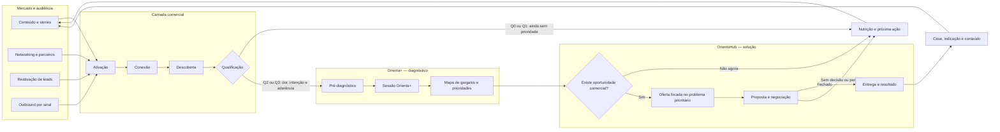
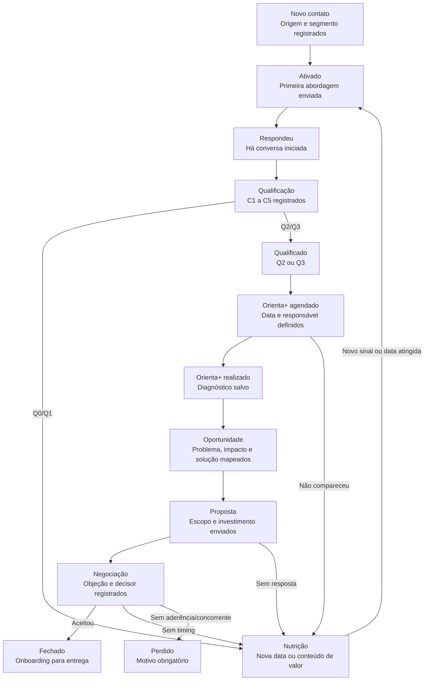
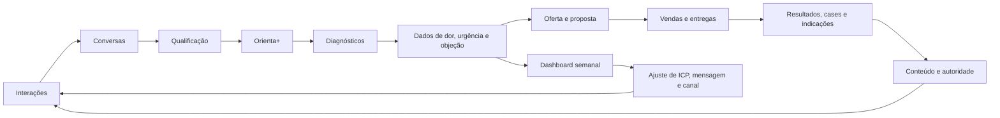
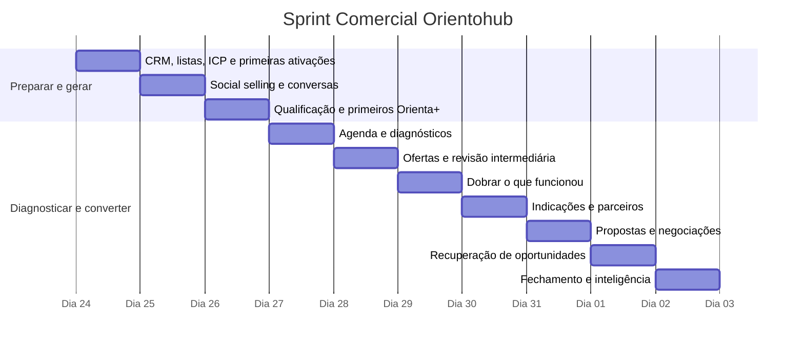

Sprint Comercial Orientohub — 10 dias úteis

# Mapa visual da operação

## 1. A ponte entre atenção, Orienta+ e OrientoHub

**Leitura:** o Orienta+ não é uma reunião de venda. Ele é a ponte: transforma uma dor relatada em um diagnóstico claro e só então conecta a necessidade à solução mais adequada do OrientoHub.

## 2. Funil no CRM: etapa, critério e próxima ação

| Etapa | Só avança quando | Próxima ação obrigatória |
| --- | --- | --- |
| Novo contato | origem, segmento e nome registrados | definir abordagem e data |
| Qualificação | contexto, causa, consequência, tentativa e intenção registrados | classificar Q0–Q3 |
| Orienta+ agendado | data/hora e decisor confirmados | enviar confirmação e pré-diagnóstico |
| Oportunidade | problema, impacto, urgência e solução possível definidos | preparar oferta focal |
| Proposta | proposta enviada ao decisor | D1, D3, D5, D7 e D10 definidos |
| Negociação | objeção classificada | registrar resposta e data de decisão |
| Nutrição/Perdido | motivo registrado | data de retomada ou motivo final |

## 3. Ciclo de inteligência comercial

**Dados que precisam voltar ao sistema:** origem do lead, segmento, dor principal, urgência, nível Q, solução indicada, objeção, motivo de perda, ticket e resultado entregue. Esses dados conectam a Sprint à evolução de conteúdo, serviços e produtos do OrientoHub.

## 4. Linha do tempo da Sprint — 10 dias úteis

> Ajuste a primeira data do gráfico para o início real da Sprint. Todos os dias mantêm a mesma cadência: prospecção, respostas, follow-ups, Orienta+, propostas e atualização do CRM.

A sprint precisa funcionar como uma máquina de geração e conversão de oportunidades, não como dez dias enviando mensagens.

A arquitetura que eu usaria é:

ATRAÇÃO → ATIVAÇÃO → CONEXÃO → QUALIFICAÇÃO → DIAGNÓSTICO → OPORTUNIDADE → OFERTA → FOLLOW-UP → FECHAMENTO → APRENDIZADO ↻

O Orienta+ entra no centro desse sistema como mecanismo de diagnóstico, geração de confiança e descoberta de oportunidades comerciais.

1. Objetivo da Sprint

O objetivo primário não deve ser simplesmente “vender”.

Precisamos validar cinco coisas:

quais perfis respondem melhor;
quais abordagens iniciam mais conversas;
quais dores aparecem com maior frequência;
quais dores possuem maior intenção de compra;
quais soluções do Orientohub apresentam maior aderência.

Assim, ao final da sprint, teremos duas entregas:

Receita + inteligência comercial.

2. Meta inicial da Sprint

Eu começaria com:

Indicador	Meta 10 dias
Pessoas ativadas	200
Conversas iniciadas	70
Conversas qualificadas	35
Orienta+ agendados	20
Orienta+ realizados	16
Oportunidades comerciais	10
Propostas	8
Fechamentos	2–3

Não trataria esses números como promessa.

São benchmarks operacionais da sprint.

Depois da primeira rodada, teremos taxas reais.

Exemplo:

200 ativações
↓ 35%
70 respostas
↓ 50%
35 qualificados
↓ 57%
20 agendamentos
↓ 80%
16 diagnósticos
↓ 62%
10 oportunidades
↓ 80%
8 propostas
↓ 25–35%
2–3 vendas

A partir daí conseguimos identificar exatamente onde está o gargalo.

3. Quem entra na Sprint

Não vamos prospectar todo mundo da mesma maneira.

Crie cinco grupos.

P1 — Quentes

Pessoas que:

responderam Stories;
comentaram;
mandaram Direct;
pediram informação;
demonstraram alguma dor;
já perguntaram sobre seu trabalho.

Prioridade máxima.

P2 — Engajados

Pessoas que:

acompanham seus Stories;
curtem frequentemente;
começaram a seguir recentemente;
compartilharam conteúdo;
salvaram conteúdo;
participam de lives.

Aqui entra fortemente social selling.

P3 — Rede existente
conhecidos;
empresários da cidade/região;
antigos contatos;
parceiros;
networking;
clientes anteriores;
pessoas que já conversaram com você profissionalmente.

Não entrar vendendo.

Entrar reconectando.

P4 — Leads antigos

Todo lead que já demonstrou alguma intenção e não comprou deve voltar para a operação.

Mas com uma nova abordagem.

Não:

“Ainda tem interesse?”

E sim retomando o contexto e investigando o momento atual.

P5 — Prospecção fria

Empresas ou empreendedores que possuem aderência clara com alguma competência do Orientohub.

Aqui a abordagem precisa carregar contexto, não spam.

4. Estratégias de aquisição

Durante a sprint, eu trabalharia simultaneamente sete mecanismos.

Estratégia 1 — Social Selling

Seu conteúdo cria o primeiro contato.

Depois você observa sinais.

Exemplo:

CONTEÚDO
↓
visualização
↓
curtida
↓
comentário
↓
visita ao perfil
↓
DM
↓
conversa comercial

Você não aborda qualquer pessoa que viu um Story.

Procura recorrência de sinais.

5. Estratégia 2 — Conteúdo → Conversa

Conteúdo precisa começar a gerar oportunidades deliberadamente.

Use CTAs como:

“Se isso acontece na sua empresa, me chama.”
“Se quiser entender onde está o gargalo, manda DIAGNÓSTICO.”
“Se você está passando por isso, comenta QUERO.”
“Se quiser uma visão externa do negócio, me chama no Direct.”

Aqui nasce uma microconversão.

Não:

Post → Comprar

Mas:

Post → Interagir → Conversar → Diagnosticar → Comprar

6. Estratégia 3 — Story Selling

Stories serão uma fonte diária da sprint.

Utilize:

Identificação

“Qual desses mais trava sua empresa hoje?”

vendas
marketing
processos
posicionamento
Diagnóstico

“Seu problema hoje é mais falta de clientes ou dificuldade para converter?”

Intenção

“Se você tivesse alguém para olhar seu negócio de fora, qual área analisaria primeiro?”

Cada resposta vira sinal comercial.

7. Estratégia 4 — Reativação

Monte uma lista:

LEADS PARADOS

Classifique:

conversou;
pediu orçamento;
disse que voltaria;
desapareceu;
não era momento;
sem orçamento;
decidiu postergar.

A pergunta principal não é:

“Quer comprar agora?”

É:

“O cenário mudou?”

Muitas oportunidades comerciais estão aqui.

8. Estratégia 5 — Indicação

Depois de uma interação positiva:

“Você conhece algum empreendedor que esteja enfrentando algo parecido?”

Isso gera introdução contextualizada.

A indicação chega com uma camada de confiança que a prospecção fria não possui.

9. Estratégia 6 — Networking comercial

Não limitar Orientohub às redes sociais.

Mapear:

contadores;
agências;
designers;
desenvolvedores;
associações;
empresários;
consultores;
fornecedores;
comunidades;
coworkings;
eventos.

O objetivo é criar canais de oportunidade.

10. Estratégia 7 — Prospecção orientada por oportunidade

Não procurar simplesmente “empresas”.

Procurar sinais.

Exemplo:

Empresa:

investindo em tráfego sem estrutura;
site ruim;
posicionamento confuso;
perfil abandonado;
crescendo sem processo;
abrindo nova unidade;
lançando produto;
contratando vendedor;
expandindo operação.

A abordagem nasce do evento.

Isso aumenta brutalmente a relevância.

11. Primeira abordagem

A primeira mensagem possui apenas uma função:

GERAR RESPOSTA.

Não apresentar:

Orientohub;
todos os serviços;
currículo;
proposta;
valores;
portfólio enorme.

A estrutura é:

CONTEXTO + CONEXÃO + PERGUNTA

Exemplo lógico:

Vi sua interação no conteúdo sobre crescimento e fui conhecer um pouco melhor o seu negócio. Hoje, qual é o principal ponto que você sente que está segurando a empresa?

A conversa começa nele.

Não em você.

12. Etapa de descoberta

Depois da resposta, usamos uma sequência curta.

C1 — Contexto

O que está acontecendo?

C2 — Causa

Por que você acredita que isso está acontecendo?

C3 — Consequência

O que esse problema está causando?

C4 — Tentativa

O que você já tentou fazer?

C5 — Intenção

É algo que você realmente pretende resolver agora?

Assim você diferencia:

dor percebida de intenção real.

13. Qualificação

Crie quatro níveis.

Q0 — Contato

Ainda não existe dor identificada.

Q1 — Interesse

Existe conversa, mas pouca urgência.

Q2 — Oportunidade

Existe:

problema;
impacto;
intenção.
Q3 — Oportunidade comercial

Existe:

problema;
prioridade;
intenção;
aderência;
capacidade de avançar.

Só Q2/Q3 deveriam consumir muito tempo comercial.

14. Entrada no Orienta+

Quando existe um problema que merece aprofundamento:

não vender imediatamente.

Convite para o diagnóstico.

A lógica:

Pelo que você está me contando, eu não te daria uma resposta pronta sem entender melhor o cenário. No Orienta+ eu consigo olhar isso junto com você, mapear os principais pontos e te mostrar onde eu começaria.

Isso muda completamente a percepção.

Não parece:

“vem para uma call para eu vender.”

Parece:

“vamos entender o problema.”

E precisa realmente ser isso.

15. Pré-diagnóstico

Antes da reunião, registrar:

empresa;
segmento;
tamanho;
principal problema;
objetivo;
canais atuais;
principais dificuldades;
quem decide;
nível de urgência;
origem do contato.

Você chega na conversa informado.

16. Estrutura do Orienta+

Eu organizaria cada sessão em cinco blocos.

01. Cenário atual

Onde está?

02. Destino

Onde deseja chegar?

03. Gargalos

O que impede?

04. Oportunidades

O que poderia ser feito?

05. Prioridades

O que deveria ser feito primeiro?

Resultado:

Diagnóstico → Mapa de oportunidades → Prioridades → Plano inicial

17. Mapeamento de oportunidade comercial

Durante o diagnóstico, registre cada problema em uma matriz.

Problema	Impacto	Urgência	Solução possível	Potencial
aquisição	alta	alta	estratégia comercial	alto
posicionamento	média	média	estratégia	médio
CRM	alta	alta	implementação	alto
conteúdo	média	alta	estratégia	médio

Agora você consegue separar:

orientação gratuita de projeto comercial.

18. Transição para venda

A venda deve nascer naturalmente do diagnóstico.

Estrutura:

Você está aqui.

↓

Quer chegar aqui.

↓

Esses são os obstáculos.

↓

Essas são as prioridades.

↓

Esse é o caminho recomendado.

↓

Aqui é onde eu consigo entrar.

Você não “empurra” serviço.

Você conecta solução ao diagnóstico.

19. Oferta

Nunca despejar todas as soluções do Orientohub.

Aplicar:

ONE PROBLEM → ONE NEXT STEP

Se o principal problema é comercial:

oferta comercial.

Se é posicionamento:

oferta estratégica.

Se é presença digital:

solução correspondente.

Quanto maior o catálogo apresentado, maior a fricção decisória.

20. Estrutura da proposta

Proposta curta.

Problema identificado

O que precisa ser resolvido.

Objetivo

Onde queremos chegar.

Escopo

O que será realizado.

Entregáveis

O que receberá.

Prazo

Quando.

Investimento

Quanto.

Próximo passo

Como começar.

Não transforme proposta em apresentação institucional de 30 páginas.

21. Follow-up

Grande parte das vendas da sprint acontecerá aqui.

Cadência:

D0

Envio da proposta.

D1

Confirmação de recebimento.

D3

Retomar decisão.

D5

Investigar objeção.

D7

Criar próximo passo.

D10

Encerrar ciclo ou reposicionar oportunidade.

Não mandar:

“E aí, conseguiu ver?”

Sempre tentar acrescentar alguma informação.

22. Objeções

Classifique, não improvise.

Preço

“Está caro.”

Timing

“Agora não.”

Confiança

“Preciso pensar.”

Autoridade

“Preciso falar com meu sócio.”

Prioridade

“Tenho outras coisas primeiro.”

Percepção de valor

“Não sei se preciso disso.”

Cada objeção precisa virar dado no CRM.

Depois de 30 propostas, você começa a enxergar padrões.

23. Recuperação

O lead que não compra não desaparece.

Vai para:

Nutrição

Ainda existe potencial futuro.

Follow-up futuro

Tem timing definido.

Desqualificado

Não possui aderência.

Perdido para concorrente

Registrar.

Sem prioridade

Continuar relacionamento.

O pipeline nunca deveria ter apenas:

GANHO / PERDIDO.

24. CRM da Sprint

Eu usaria estas etapas:

NOVO CONTATO

↓

ATIVADO

↓

RESPONDEU

↓

QUALIFICAÇÃO

↓

QUALIFICADO

↓

ORIENTA+ AGENDADO

↓

ORIENTA+ REALIZADO

↓

OPORTUNIDADE

↓

PROPOSTA

↓

NEGOCIAÇÃO

↓

FECHADO

ou

NUTRIÇÃO / PERDIDO

25. Tags

Além da etapa, registre tags.

Origem

Instagram

WhatsApp

Indicação

Networking

Outbound

Lead antigo

Dor

Vendas

Marketing

Processos

Estratégia

Tecnologia

Posicionamento

Temperatura

Frio

Morno

Quente

Timing

Agora

30 dias

90 dias

Futuro

Isso vai gerar inteligência comercial para o Orientohub.

26. Rotina diária da Sprint
BLOCO 1 — Prospecção

20 novas ativações.

BLOCO 2 — Respostas

Responder rapidamente conversas em andamento.

BLOCO 3 — Follow-ups

Nenhuma oportunidade parada sem próxima ação.

BLOCO 4 — Orienta+

Realizar diagnósticos.

BLOCO 5 — Propostas

Enviar propostas no mesmo dia sempre que possível.

BLOCO 6 — CRM

Atualizar:

estágio;
dor;
próxima ação;
data;
motivo;
oportunidade.
27. Regra central

Todo contato precisa ter:

STATUS ATUAL

e

PRÓXIMA AÇÃO

Exemplo:

Status: proposta enviada.

Próxima ação: follow-up em 24/08.

Se não existe próxima ação, a oportunidade está abandonada.

28. Cronograma da Sprint
Dia 1 — Preparação + ativação
organizar CRM;
criar listas;
definir ICP;
separar leads;
ativar primeiros contatos;
começar reativação.

Objetivo: colocar pipeline em movimento.

Dia 2 — Social selling
interações Instagram;
respostas de Stories;
comentários;
seguidores recentes;
novos contatos.

Objetivo: gerar conversas.

Dia 3 — Qualificação

Foco em transformar conversas em:

problemas;
necessidades;
intenção.

Começam os primeiros Orienta+.

Dia 4 — Diagnóstico

Aumentar agenda de Orienta+.

Registrar padrões de dor.

Dia 5 — Primeiras ofertas

Analisar diagnósticos.

Gerar:

oportunidades;
propostas;
soluções.
Revisão intermediária

No fim do quinto dia:

Qual abordagem mais respondeu?
Qual público respondeu?
Qual dor apareceu?
Quantos foram qualificados?
Quantos Orienta+?
Onde estamos perdendo pessoas?

A partir daí ajustamos os próximos cinco dias.

Dia 6 — Dobrar o que funcionou

Eliminar abordagens fracas.

Aumentar volume das melhores.

Dia 7 — Indicações + parceiros

Ativar:

clientes;
conhecidos;
parceiros;
rede profissional.
Dia 8 — Conversão

Foco maior em:

propostas;
follow-ups;
objeções;
negociações.
Dia 9 — Recuperação

Revisar:

quem não respondeu;
quem adiou;
quem recebeu proposta;
quem demonstrou intenção.

Criar segunda oportunidade de conversa.

Dia 10 — Fechamento + inteligência

Realizar fechamento da sprint.

Mas principalmente levantar dados.

29. Dashboard diário

Acompanhe:

TOPO

Ativações

Respostas

Taxa de resposta

MEIO

Qualificados

Taxa de qualificação

Orienta+ agendados

Show rate

FUNDO

Oportunidades

Propostas

Taxa proposta/oportunidade

Fechamentos

Conversão

Ticket médio

Receita

30. Métricas mais importantes

Eu acrescentaria algumas extremamente valiosas.

Taxa de ativação → resposta

respostas ÷ abordagens

Resposta → qualificado

qualificados ÷ respostas

Qualificado → Orienta+

agendamentos ÷ qualificados

Show rate

realizados ÷ agendados

Diagnóstico → oportunidade

oportunidades ÷ diagnósticos

Oportunidade → proposta

propostas ÷ oportunidades

Proposta → fechamento

vendas ÷ propostas

31. Métrica que eu considero estratégica
Taxa de dor recorrente

Exemplo:

Em 30 diagnósticos:

12 falam vendas;
7 marketing;
5 processos;
4 posicionamento;
2 tecnologia.

Você acabou de descobrir onde existe maior demanda percebida.

Isso serve para:

COMERCIAL

↓

OFERTA

↓

CONTEÚDO

↓

PRODUTO

↓

MVP

↓

VERTICAL

Ou seja, a própria sprint alimenta o ecossistema do Orientohub.

32. Feedback Loop Comercial

Essa é uma parte que eu adicionaria ao modelo:

CONTEÚDO

gera

CONVERSAS

gera

DADOS

gera

DIAGNÓSTICOS

gera

OPORTUNIDADES

gera

OFERTAS

gera

VENDAS

gera

APRENDIZADOS

que voltam para

CONTEÚDO ↻

Exemplo:

Se dez empresários falarem:

“Tenho leads, mas meu atendimento não converte.”

Isso imediatamente vira:

dor comercial + conteúdo + serviço + possível produto.

33. Regras da Sprint

Eu colocaria dez regras.

Nenhum lead sem próxima ação.
Nenhuma proposta sem diagnóstico.
Nenhuma abordagem longa.
Nenhuma conversa começando com apresentação institucional.
Não vender antes de entender.
Registrar toda objeção.
Registrar todo motivo de perda.
Follow-up obrigatório.
Dobrar rapidamente o que funcionar.
Todo aprendizado comercial volta para marketing.
34. O verdadeiro funil

No fim, teremos:

ATENÇÃO
   ↓
INTERAÇÃO
   ↓
ATIVAÇÃO
   ↓
CONVERSA
   ↓
QUALIFICAÇÃO
   ↓
ORIENTA+
   ↓
DIAGNÓSTICO
   ↓
OPORTUNIDADE
   ↓
PROPOSTA
   ↓
NEGOCIAÇÃO
   ↓
VENDA
   ↓
ENTREGA
   ↓
INDICAÇÃO
   ↺

Mas existe uma coisa ainda mais importante.

A sprint não termina no fechamento.

VENDA → RESULTADO → CASE → CONTEÚDO → AUTORIDADE → NOVA DEMANDA.

É assim que a operação comercial começa a criar efeito composto.

35. Arquitetura final

Eu dividiria o Sprint Comercial Orientohub oficialmente em 7 módulos:

S1 — GERAR

Criar oportunidades de conversa.

S2 — CONECTAR

Transformar atenção em relacionamento.

S3 — DESCOBRIR

Identificar contexto, dor e intenção.

S4 — DIAGNOSTICAR

Usar o Orienta+ para entender profundamente.

S5 — DIRECIONAR

Mapear oportunidades e prioridades.

S6 — CONVERTER

Oferta, proposta, follow-up e fechamento.

S7 — APRENDER

Transformar cada interação em inteligência.

E essa última camada é o diferencial:

o objetivo da sprint não é simplesmente perseguir clientes. É construir um sistema comercial que fica mais inteligente a cada conversa.
